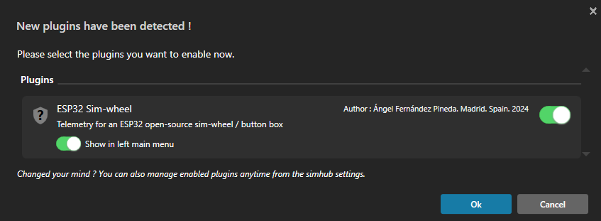

# SimHub plugin for ESP32 open-source sim-wheels or button boxes

This project provides a [SimHub](https://www.simhubdash.com/)
plugin to send telemetry data to
[ESP32 open-source](https://github.com/afpineda/OpenSourceSimWheelESP32)
sim-wheels and button boxes.
Basic device settings can also be configured.

## Installing

1. Download the latest package.
2. Unzip to the SimHub installation folder, typically:
    `C:\Program Files (x86)\SimHub\`
3. Run SimHub.
4. It should detect this plugin automatically:

   

5. Click the right button to activate it, then click "Show in left main menu".
6. A new item will appear in the left main menu, called "ESP32 Sim-wheel".

### Upgrading to a newer version

Just repeat the unzip procedure.
There is no need to re-activate this plugin again
except when asked.

## Running

- To interact with this plugin, click on "ESP32 Sim-wheel" option
  in the left menu panel.
- The plugin does **not** detect new devices at connection.
  If your device is not detected, you can force a **refresh** in two ways:
  - Pause your game.
  - Click on the "Refresh" button.
- Telemetry data will be sent to all connected and suitable devices.

### Bind settings to game and car (how it works)

This feature stores the device configuration for each game and car,
and applies it when the game or car is changed.

For bindings to work:

- The "Bind to current game and car" option must be checked.
- A game must be selected in SimHub.
- A car must be selected in-game.

Applies to all detected devices.
The bound settings are limited to clutch paddles (working mode and bite point),
"ALT buttons" (working mode) and DPAD (working mode).
You can configure those device settings using SimHub,
the companion app or the device itself.

- **SimHub ➡️ device**.
  Saved settings (if any) are restored to each device when:
  - A new device is detected.
  - Current game or car is changed.
  - The user checks "Bind to current game and car".

- **Device ➡️ SimHub**.
  When you press the "Bind current settings to current game/car" button,
  settings from all devices are bound to the current game and car,
  then saved.

### Device settings

Select a device to configure in the combo box.
Only basic configurable options will be shown in the corresponding tab.
For advanced configuration use the
[companion app](https://github.com/afpineda/SimWheelESP32Config).

### Telemetry data

Devices that accept raw telemetry will receive it as long as they are detected.
There is nothing to configure.

### Troubleshooting

Plugin activity is shown in the `logs\simhub.txt` file relative to
your installation folder. Typically:
`C:\Program Files (x86)\SimHub\logs\simhub.txt`.

Open that file and look for the string `[ESP32 Sim-wheel]`.

### How to reset plugin settings

Settings are stored in the
`PluginsData\Common\ESP32SimWheelPlugin.GeneralSettings.json`
file relative to your installation folder.
You may delete that file to forget all device/game/car bindings.
